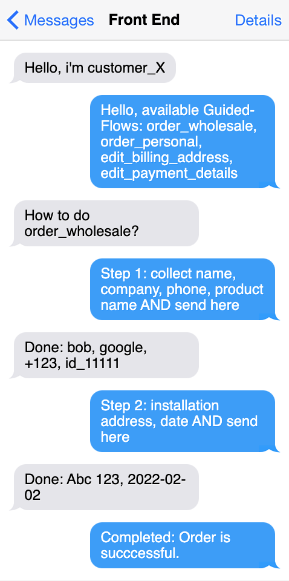

# Guided-Flow 🧑‍🦯

      This repository is a basic setup to test **Guided-Flow** paradigm.
      Bring up discussion, test real-life scenarions, find hidden stones.

---

## Basic idea

This screenshot illustrates the intent behind **Guided-Flow**



---

## Postulates

1. ### It is the API who Defines **Guided-Flow** steps.

   It is important to define responsibilities here.

   - Back-end is responsible for offering **Guided-Flows** according to current users rights, access group, login status etc.
   - Front-end code is clueless about the business logic - it only collects data.
   - Front-end communicates with the api upon each step's data submission.
   - Guided-Flow steps contain clear instructions: what and how should be collected.
   - Front-end does not perform any api queries in between the **Guided-Flow** steps.

---

## Start project

```
# install all node_modules
cd front && npm i && cd ../api && npm i

# Start client
cd front
npm start

# Start backend
cd api
npm start
```

## You may wonder
